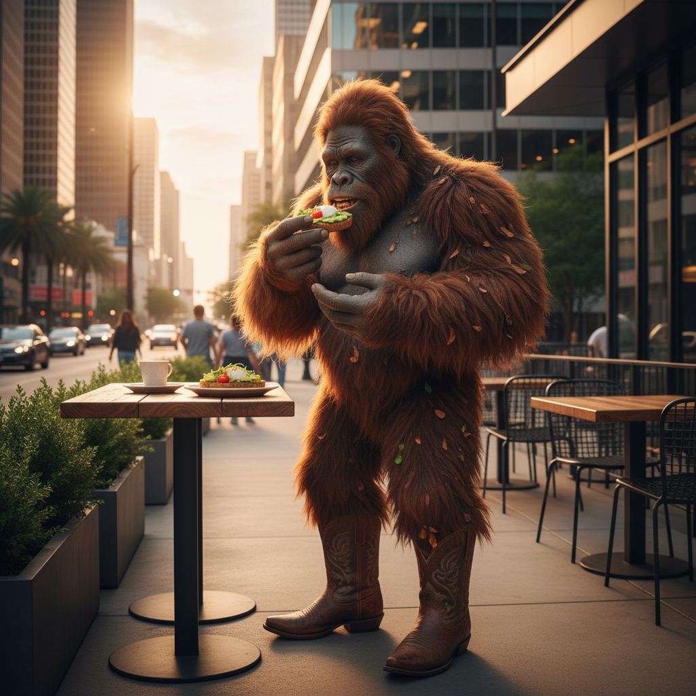

<!-- This repository contains an image asset featuring a creative mashup of Bigfoot, Houston, and avocado toast themes. -->

# bigfoot-houston-avo-toast-1772998441751

A creative image repository combining three unlikely subjects: **Bigfoot**, **Houston**, and **avocado toast**.



---

## 📋 Overview

This repository hosts a single image asset that brings together the whimsical intersection of Bigfoot lore, Houston culture, and the ever-popular avocado toast. Whether it's for a meme, a creative project, or just for fun — it lives here.

## 📁 Project Structure

| File | Description |
|------|-------------|
| `README.md` | This documentation file |
| `bigfoot-houston-avo-toast.png` | The main image asset |

## 🖼️ Usage

To use the image in your own project, you can reference it directly:

```markdown

```

Or clone the repository:

```bash
git clone https://github.com/farmrecipes67/bigfoot-houston-avo-toast-1772998441751.git
```

## 📄 License

No license has been specified for this repository. Please contact the repository owner for usage permissions.

---

<sub>This README was auto-generated. Last updated: 2026-03-08</sub>